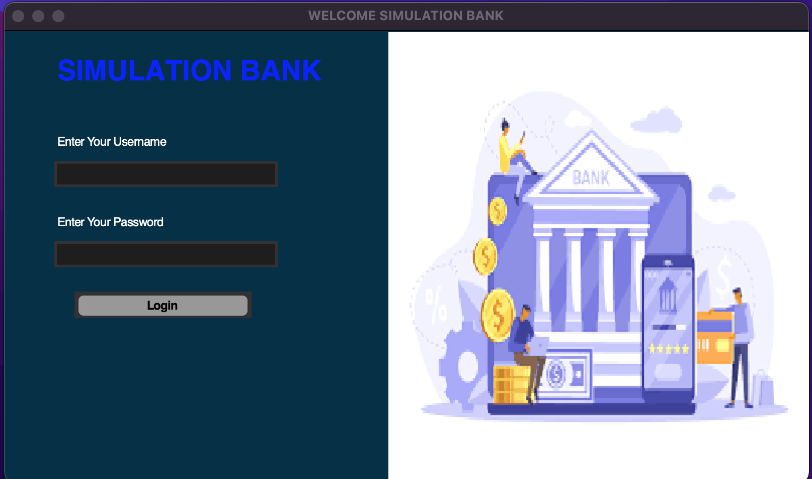
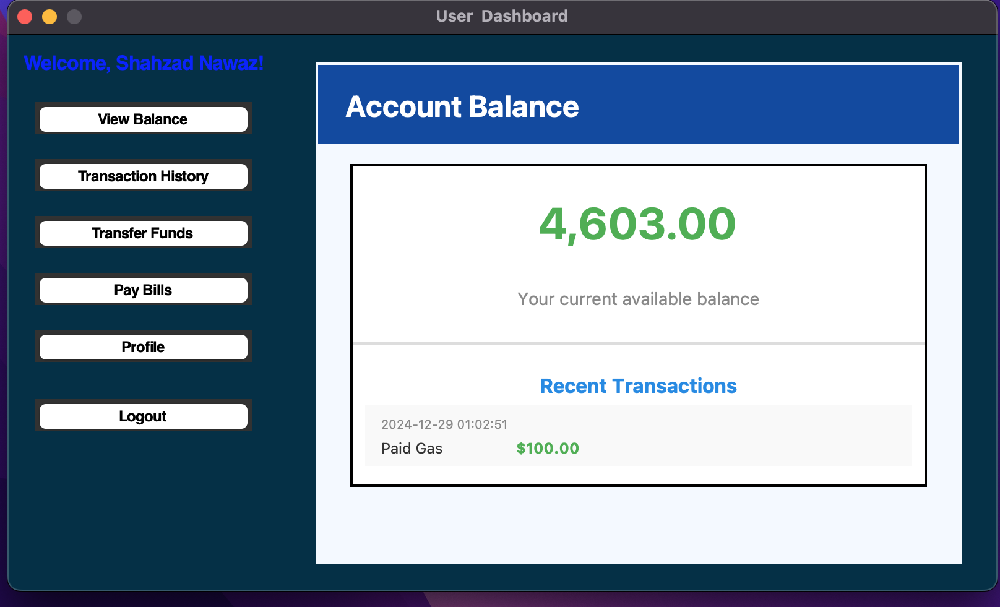
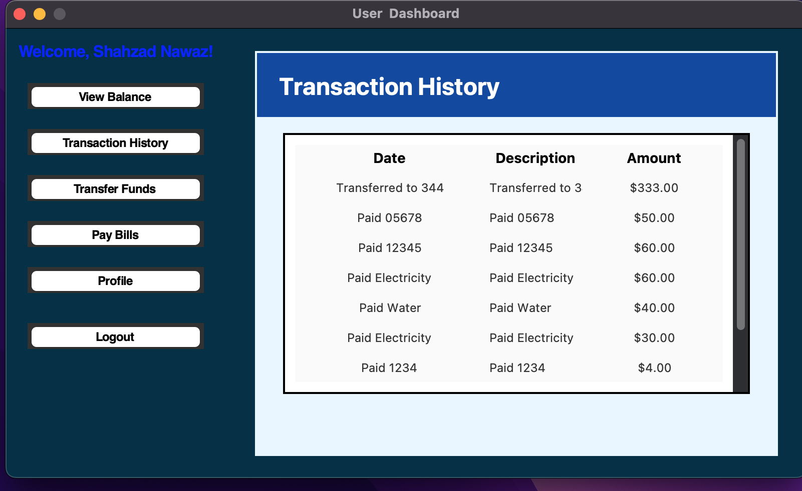

# Simulation Bank

Simulation Bank is a Python-based desktop application designed to simulate basic functionalities of an online banking system. The application uses Tkinter for the graphical user interface and integrates with a MySQL database for user authentication and financial operations.

## Features

- **User Authentication**: Secure login system with database integration.
- **Account Dashboard**: Displays the user’s current account balance and recent transactions.
- **Transaction History**: View detailed records of past transactions.
- **Fund Transfer**: Transfer money to other accounts.
- **Bill Payments**: Pay utility bills directly from your account.

## Prerequisites

To run this project, ensure you have the following installed:

- Python 3.8+
- MySQL Server
- Required Python libraries: Tkinter, PIL (Pillow), and MySQL Connector

## Installation

1. **Clone the Repository**:
2. 
   git clone https://github.com/yourusername/simulation-bank.git
   cd simulation-bank


3. **Install Dependencies**:

   Install the required Python libraries:

   pip install mysql-connector-python pillow
   
4. **Setup Database**:

   Create a MySQL database and import the provided schema (`database.sql`) into your server.

   CREATE DATABASE simulation_bank;
   USE simulation_bank;
   -- Import the schema provided in the repository


5. **Configure Database Connection**:

   Update the `db_connection()` function in `database.py` with your database credentials:

   ```python
   def db_connection():
       return mysql.connector.connect(
           host="localhost",
           user="your_username",
           password="your_password",
           database="simulation_bank"
       )
   ```

6. **Run the Application**:

   Execute the main file:

   python main.py

## File Structure


.
├── main.py              # Entry point for the application
├── dashboard.py         # Contains the dashboard logic
├── database.py          # Handles database operations
├── images/              # Contains application images
├── README.md            # Project documentation
└── database.sql         # Database schema and initial data


## Screenshots

1. **Login Screen**:
   

2. **Dashboard**:
   

3. **Transaction History**:
   


## Acknowledgments

- **Pillow** for image processing.
- **Tkinter** for GUI development.
- **MySQL** for database management.

## Contact

For any queries, feel free to reach out at testinguse3141@gmail.com.

